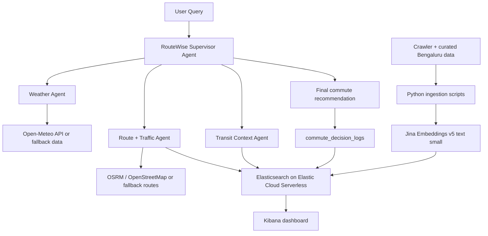

# RouteWise Bengaluru

AI-powered multi-agent commute intelligence for Bengaluru, built for AWS UG Bengaluru HackNight.

## Problem Statement

### 02 - Commute Intelligence

Every Bengaluru morning is the same calculation: traffic, BMTC, Metro, parking, weather, school timings, route choice, mode choice, and departure time.

People usually answer this question with vibes.

RouteWise Bengaluru answers it with transparent reasoning grounded in real feeds, curated local context, and Elasticsearch retrieval.

Example:

> Leave in 18 minutes, take Metro to MG Road, walk the last kilometre. Here is why.

## What This MVP Builds

RouteWise Bengaluru is a hackathon-ready multi-agent system. It recommends:

- when to leave
- which mode to use
- which route to prefer
- what risks matter
- what alternatives exist
- how confident the recommendation is

The MVP intentionally avoids unnecessary infrastructure.

No EC2. No separate frontend. No normal backend server. No extra microservices.

## Final Architecture



## Low-Level Flow

```txt
User asks a commute question
  -> Supervisor extracts source, destination, time, and preferences
  -> Supervisor calls Weather Agent
  -> Supervisor calls Route + Traffic Agent
  -> Supervisor calls Transit Context Agent
  -> Specialists retrieve structured and contextual evidence
  -> Supervisor compares evidence and chooses the most predictable option
  -> Final decision is logged to Elasticsearch
  -> Kibana shows indexed data and decision logs
```

## Tech Stack

- Elastic Agent Builder for agent development and demo chat
- Amazon Bedrock for LLM reasoning
- Claude 3.5 Sonnet for Supervisor and Route + Traffic Agents
- Amazon Nova Lite or Claude Haiku for Weather and Transit Context Agents
- Elasticsearch on Elastic Cloud Serverless for structured and vector search
- Kibana for dashboard and demo storytelling
- Jina Embeddings v5 text small for semantic contextual retrieval
- Python 3.11 for tools, crawling, embeddings, and ingestion

## Repository Structure

```txt
commute-copilot-bangalore/
├── README.md
├── .env.example
├── requirements.txt
├── ingestion/
│   ├── ingest_sample_data.py
│   ├── crawl_sources.py
│   ├── generate_embeddings.py
│   └── sample_data/
├── elastic/
│   ├── create_indices.py
│   ├── mappings/
│   └── queries/
├── tools/
├── agents/
└── docs/
```

## Elasticsearch Indices

- `commute_context`: unstructured commute notes, advisories, events, and local context with dense vectors
- `commute_places`: metro stations, hotspots, parking zones, and locality context
- `commute_routes`: sample and API-derived route alternatives with reliability fields and dense vectors
- `commute_decision_logs`: final Supervisor decisions for transparency and dashboarding

Embeddings are used only for semantic/contextual retrieval. Exact ETA, weather, and route duration should come from structured fields or APIs.

## Setup

1. Create a Python environment.

```bash
python -m venv .venv
.venv\Scripts\activate
pip install -r requirements.txt
```

2. Copy the environment template.

```bash
copy .env.example .env
```

3. Fill in Elastic, Jina, and AWS Bedrock credentials if available. The tools include sample fallbacks, so the local demo can still run without live credentials.

4. Create Elasticsearch indices.

```bash
python elastic/create_indices.py
```

5. Generate embeddings for sample context.

```bash
python ingestion/generate_embeddings.py
```

6. Ingest sample data.

```bash
python ingestion/ingest_sample_data.py
```

## Demo Flow

Demo query:

```txt
I am at Spice Garden and need to reach MG Road by 6 PM. What should I do?
```

Expected answer shape:

```txt
Leave in 18 minutes.

Best option: Metro + walk.

Route: Spice Garden -> Indiranagar Metro -> MG Road -> walk 900m.

Why:
- Metro is more predictable during evening traffic.
- Cab has high congestion risk around Domlur and Indiranagar.
- Rain risk is moderate, but walking is manageable.
- Parking near MG Road is unreliable during evening hours.

Alternative: Cab via Old Airport Road, but reliability is lower.

Confidence: 84%
```

## Agent Files

The `agents/` directory contains copy-ready instructions for Elastic Agent Builder:

- `supervisor_agent.md`
- `weather_agent.md`
- `route_traffic_agent.md`
- `transit_context_agent.md`

## Why This Is Hackathon-Ready

RouteWise keeps the system small enough to demo reliably. Ingestion runs before the demo. Agents query Elasticsearch during the live answer. The Supervisor explains its decision and logs the result for Kibana.

The core story is simple: Bengaluru commute choices are uncertain, but the agent can make the tradeoff visible.
