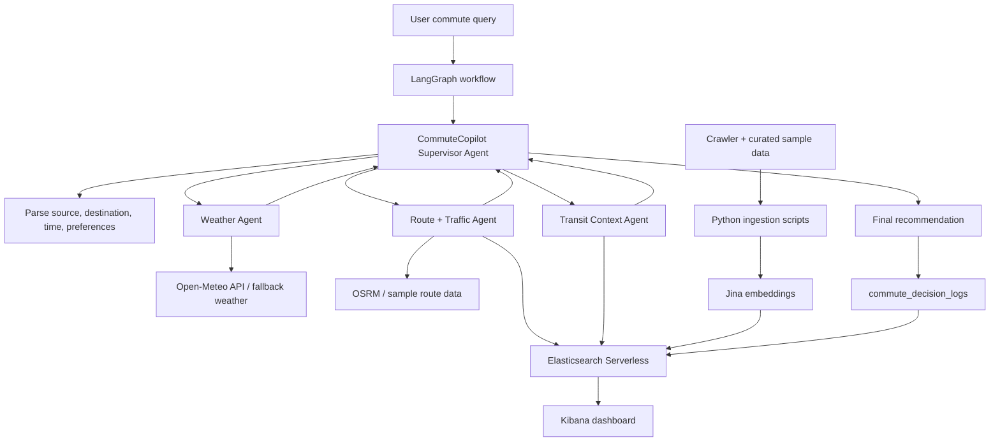

# Commute-Copilot Bengaluru

Hackathon MVP for AWS UG Bengaluru HackNight: a multi-agent commute intelligence system that returns a clear recommendation with evidence, risks, alternatives, and confidence.

## What This Project Is

- No custom frontend
- No normal backend server
- No EC2
- Multi-agent orchestration using `LangGraph`
- Bedrock model calls via `LangChain` (`langchain-aws`)
- Elasticsearch Serverless for structured + semantic context retrieval

## Runtime Architecture



## Code Layout

```text
commute-copilot-bangalore/
  main.py                     # CLI entrypoint (runs full agent graph)
  orchestration_graph.py      # LangGraph workflow
  llm_provider.py             # LangChain Bedrock wrapper
  check_stack.py              # Elastic + Bedrock health check
  agents/*.py                 # executable agents
  agents/*.md                 # Agent Builder prompt docs
  tools/*.py                  # weather/route/traffic/transit/elastic/log tools
  ingestion/*.py              # crawl/embed/ingest scripts
  elastic/*.py,json,esql      # index creation + mappings + query templates
```

## Python

Recommended: Python `3.11`. The commands below use the Windows Python launcher (`py`) so they work even when `python` is not on PATH.

## Environment Variables

Create `.env` from `.env.example` and fill:

- `ELASTICSEARCH_URL`
- `ELASTICSEARCH_API_KEY`
- `JINA_API_KEY` (optional; fallback embeddings exist)
- `JINA_EMBEDDING_MODEL=jina-embeddings-v5-text-small`
- `AWS_REGION`
- `BEDROCK_SUPERVISOR_MODEL`
- `BEDROCK_ROUTE_MODEL`
- `BEDROCK_LIGHT_MODEL`
- optional AWS auth vars if not using profile/instance creds:
  - `AWS_ACCESS_KEY_ID`
  - `AWS_SECRET_ACCESS_KEY`
  - `AWS_SESSION_TOKEN`

For workshop/demo accounts, `amazon.nova-lite-v1:0` is the safest default for all three Bedrock model variables. Some older Claude model IDs may be retired or unavailable in the event account.

## Install

```bash
py -3.10 -m pip install -r requirements.txt
```

Use `py -3.11` if you have Python 3.11 installed.

## One-Time Data Setup

```bash
py -3.10 elastic/create_indices.py
py -3.10 ingestion/generate_embeddings.py
py -3.10 ingestion/ingest_sample_data.py
```

Optional crawler refresh:

```bash
py -3.10 ingestion/crawl_sources.py
```

## Run

Local reasoning (tools + heuristics, no Bedrock):

```bash
py -3.10 main.py "I am at Spice Garden and need to reach MG Road by 6 PM. What should I do?"
```

Bedrock reasoning enabled:

```bash
py -3.10 main.py "I am at Spice Garden and need to reach MG Road by 6 PM. What should I do?" --use-bedrock
```

Verbose agent run:

```bash
py -3.10 main.py "I am at Spice Garden and need to reach MG Road by 6 PM. What should I do?" --verbose
```

Output includes:

- `trace`: proves each graph node/agent ran
- `evidence`: weather, route/traffic, transit payloads
- `decision_log`: Elasticsearch log status
- `bedrock_status` and `bedrock_errors`: model call status per agent

## Health Check

```bash
py -3.10 check_stack.py
```

This verifies:

- Elasticsearch connectivity and index counts
- Bedrock model invocation readiness

## Kibana Dashboard / UI

Current runnable UI: terminal JSON output from `main.py`.

For judge-facing demo UI:

1. Open Kibana in Elastic Cloud Serverless
2. Create data views for:
   - `commute_context`
   - `commute_places`
   - `commute_routes`
   - `commute_decision_logs`
3. Build a simple dashboard with:
   - index document counts
   - table of latest decision logs
   - route reliability/traffic views

You can also use Elastic Agent Builder chat as an external demo interface using `agents/*.md` prompts.

## AgentCore

AgentCore deployment steps are in `docs/agentcore_deploy.md`.

## Demo


