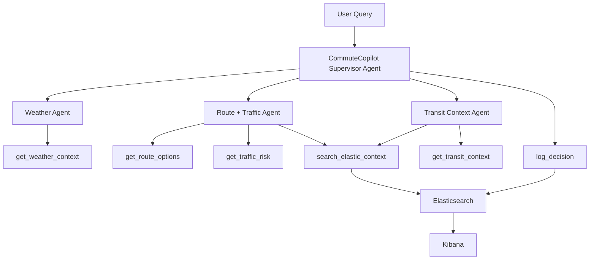

# Architecture

CommuteCopilot Bengaluru is intentionally small: three specialist agents report evidence to one Supervisor Agent, and the Supervisor makes the final commute decision.

## Runtime Components

- Elastic Cloud Serverless hosts Elasticsearch and Kibana.
- Elastic Agent Builder provides the demo chat and agent configuration.
- Amazon Bedrock provides LLM reasoning.
- Local Python scripts prepare sample data, crawl optional context, generate embeddings, and ingest records.

No EC2, custom frontend, or normal backend server is required for the MVP.

## High-Level Design

## Data Design

`commute_context` stores local commute notes and advisories with embeddings for semantic retrieval.

`commute_places` stores structured places such as metro stations, hotspots, and parking zones.

`commute_routes` stores route alternatives with duration, distance, risk, reliability, and route-summary embeddings.

`commute_decision_logs` stores final recommendations for transparency, evaluation, and dashboarding.

## Query-Time Flow

1. Supervisor parses source, destination, target time, and preferences.
2. Weather Agent checks rain and walking comfort.
3. Route + Traffic Agent compares route options, hotspots, reliability, and parking.
4. Transit Context Agent checks metro, BMTC, and last-mile feasibility.
5. Supervisor chooses the most predictable option and explains the tradeoff.
6. Supervisor logs the decision to Elasticsearch.

## Ingestion-Time Flow

1. Run crawler or curated data preparation.
2. Generate Jina embeddings for context and route summaries.
3. Create indices with dense vector fields.
4. Ingest sample data into Elasticsearch.

Live crawling should not be part of the main demo response path because it is slower and less predictable.
